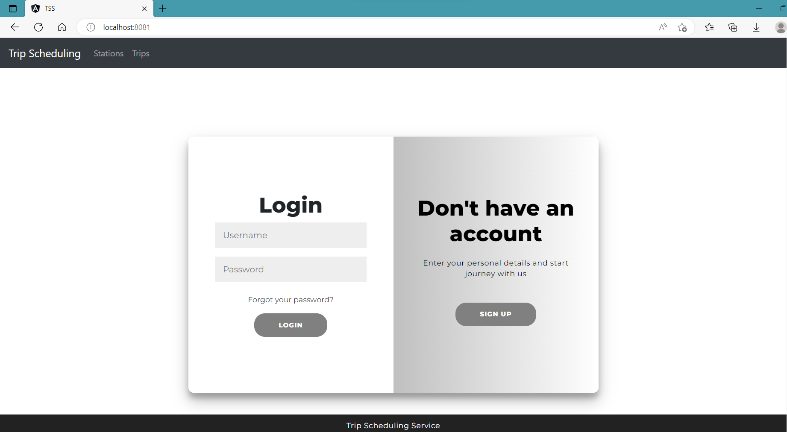
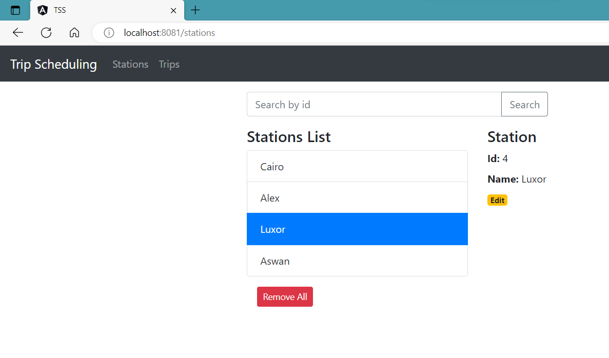

# Trip Scheduling Service
# Spring Boot + Angular 14 + MySQL CRUD example

Full-stack Angular 14 + Spring Boot + MySQL CRUD operations in that:

Trip:
- Each Trip has id, start and end time as well as from and to station.
- We can create, retrieve, update, delete Trips.
- We can also find Trip by id.

Station:
- Each Station has id and a name.
- We can create, retrieve, update, delete Stations.
- We can also find Station by id.

Admin:
- Each Admin has unique username and a password, as well as keeping track of his login status.
- Admin can sign up, sign in, create a trip, update a trip by id, delete a trip by id, show all scheduled trips,
  show all stations.

## Homepage


## Station List


## Run Spring Boot application
```
mvn spring-boot:run
```
The Spring Boot Server will export API at port `8081`.

## Run Angular Client
```
cd .\angular-14-client\
npm install
ng serve --port 8081
```